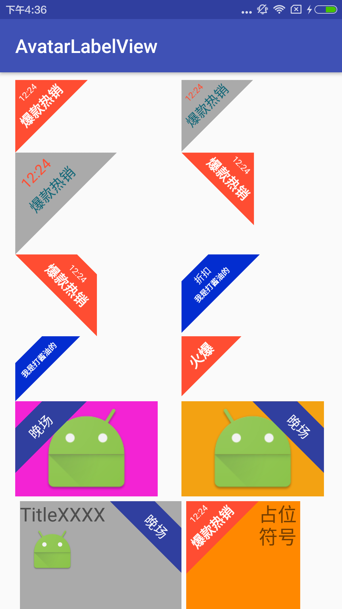

# AvatarLabelView

一个可配置的迷你版轻量级 Label 辅助类，支持多种配置效果，具体不同配置展示效果如下图。

<div></div>

# 说明文档

如下是关于 Label View 的相关使用方式、属性说明、拓展自定义的解释说明。

### 使用样例

```xml
<cn.label.avatarlabelview.LabelImageView
    app:textContent="晚场"
    app:textContentSize="14sp"
    app:direction="rightTop"
    app:labelTopDistance="20dp"
    app:labelTopPadding="10dp"
    app:labelBottomPadding="10dp"
    app:backgroundColor="@color/colorPrimaryDark"
    android:src="@mipmap/ic_launcher"
    android:background="#f3a212"
    android:layout_width="150dp"
    android:layout_height="100dp"/>
```

### 已实现类说明

| 类别 | 类名 | 说明 |
| ----- | ----- | ----- |
| library | LabelViewHelper | 标签辅助核心实现类 |
| library | LabelView | 基于 LabelViewHelper 实现的一个纯标签 View，可嵌套在 ViewGroup 中使用等 |
| demo | LabelImageView | 基于 LabelViewHelper 实现的一个具备标签的 ImageView，可属性配置等 |
| demo | LabelLinearLayout | 基于 LabelViewHelper 实现的一个具备标签的 LinearLayout，可属性配置等 |
| customer | XxxView | 类比上面 demo 中基于 LabelViewHelper 实现自己的 Label View |

### 属性说明

| 属性 | 含义 |
| ----- | ----- |
|app:backgroundColor | Label 的背景颜色 |
|app:textTitleColor | 第一行文字的颜色，如果 Label 作为单行（不设置textTitle）则无效 |
|app:textContentColor | 第二行文字的颜色 |
|app:textTitle | 第一行文字的内容，如果文字过长注意调节 labelTopPadding 的值变大，单行 Label 时不要设置此值 |
|app:textContent | 第二行文字的内容，单行显示时推荐用此 |
|app:textTitleSize | 第一行文字的大小，默认10sp，如果 Label 作为单行（不设置textTitle）则无效 |
|app:textContentSize | 第二行文字的大小，默认12sp |
|app:labelTopPadding | 第一行文字上边缘距离背景顶部（注意三角形或者梯形）的偏移量，默认为15dp |
|app:labelCenterPadding | 第一行文字底部与第二行文字顶部之间的偏移距离 |
|app:labelBottomPadding | textContent 文字与 Label 背景底部的空隙距离，默认为 10dp |
|app:labelTopDistance | 当设置该值大于0时显示的 Label 为梯形的样式，梯形上顶宽度与该值成正比；当不设置时 Label 为三角形样式 |
|app:textTitleStyle | 第一行文字的样式，normal、italic、bold，如果 Label 作为单行（不设置textTitle）则无效 |
|app:textContentStyle | 第二行文字的样式，normal、italic、bold |
|app:direction | Label 的位置，leftTop 或者 rightTop |

### 拓展为自己 View 使用方式

1. 在自己的自定义 View 构造方法创建 LabelViewHelper 对象。
2. 在自己的自定义 View 相关绘制方法（onDraw、dispatchDraw 等）中调用 LabelViewHelper 的 drawLabel 方法。
3. 至此你的自定义 View 就支持可配置的 Label 效果了，如需别的拓展可以参考 demo 或者查看 LabelViewHelper 其他方法。

具体拓展应用到自己自定义的其他控件中如下：

```java
public class LabelImageView extends YourCustomerView {
    //......
    public LabelImageView(Context context, AttributeSet attrs, int defStyleAttr) {
        super(context, attrs, defStyleAttr);
        mLabelViewHelper = new LabelViewHelper(context, attrs);
    }

    //注意：ViewGroup 最好重写 dispatchDraw 方法
    @Override
    protected void onDraw(Canvas canvas) {
        super.onDraw(canvas);
        mLabelViewHelper.drawLabel(this, canvas);
    }
    //......
}
```

# License 声明

MIT License

Copyright (c) 2016 yanbo

Permission is hereby granted, free of charge, to any person obtaining a copy
of this software and associated documentation files (the "Software"), to deal
in the Software without restriction, including without limitation the rights
to use, copy, modify, merge, publish, distribute, sublicense, and/or sell
copies of the Software, and to permit persons to whom the Software is
furnished to do so, subject to the following conditions:

The above copyright notice and this permission notice shall be included in all
copies or substantial portions of the Software.

THE SOFTWARE IS PROVIDED "AS IS", WITHOUT WARRANTY OF ANY KIND, EXPRESS OR
IMPLIED, INCLUDING BUT NOT LIMITED TO THE WARRANTIES OF MERCHANTABILITY,
FITNESS FOR A PARTICULAR PURPOSE AND NONINFRINGEMENT. IN NO EVENT SHALL THE
AUTHORS OR COPYRIGHT HOLDERS BE LIABLE FOR ANY CLAIM, DAMAGES OR OTHER
LIABILITY, WHETHER IN AN ACTION OF CONTRACT, TORT OR OTHERWISE, ARISING FROM,
OUT OF OR IN CONNECTION WITH THE SOFTWARE OR THE USE OR OTHER DEALINGS IN THE
SOFTWARE.